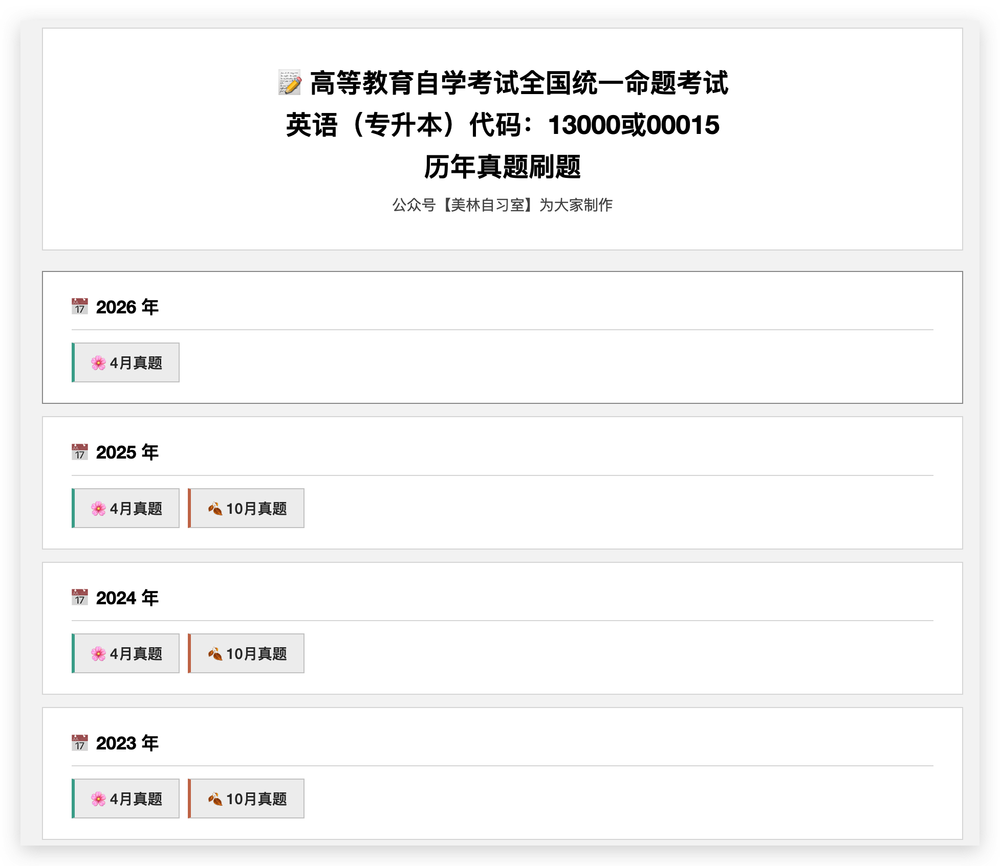
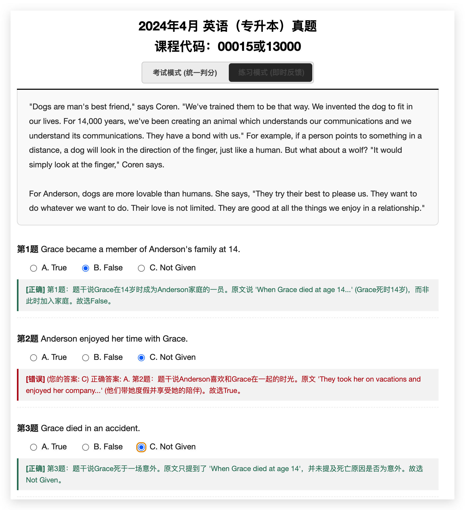
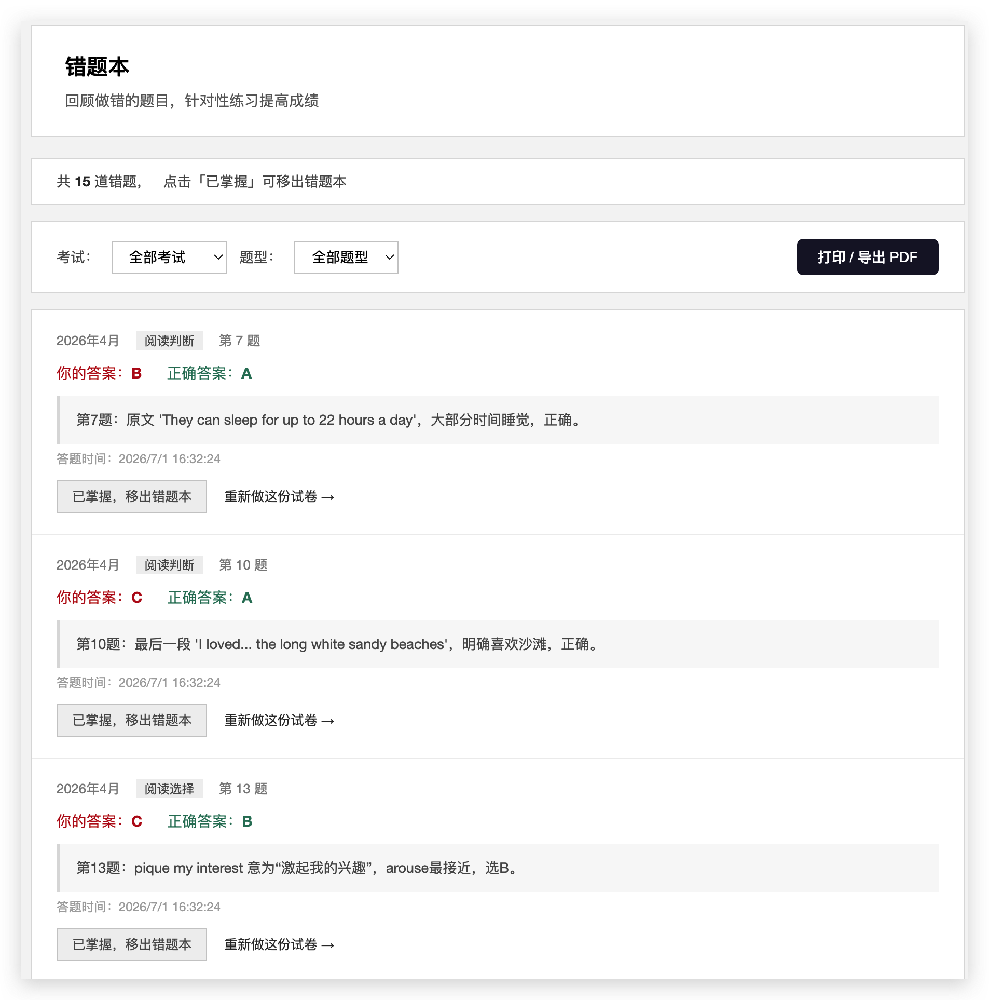
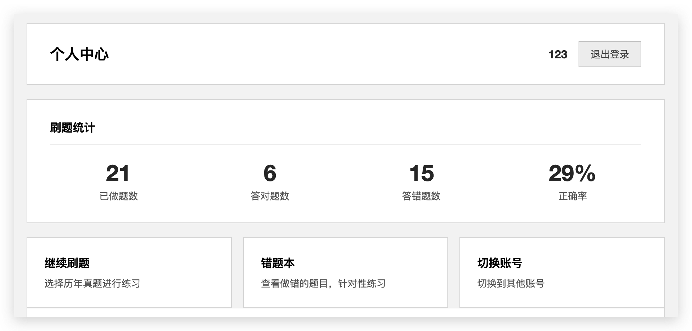

# 自考英语（专升本）历年真题刷题平台

在线刷题平台，涵盖 **2017–2026 年**全国自考英语（专升本）**课程代码 00015 / 13000** 的历年真题。无需安装 App，浏览器打开即用。

> 全静态站点，所有数据存储在浏览器本地，无需后端服务器。

---

## 功能一览

### 📋 历年真题列表
首页展示 2017–2026 全部真题，点击即可进入答题。



### ✏️ 两种答题模式

| 模式 | 说明 |
|------|------|
| **考试模式** | 全部答完后统一提交判分，模拟真实考试体验 |
| **练习模式** | 每道题即时反馈对错和解析，适合边做边学 |




### 📊 错题本
自动收集所有做错的题目，支持按考试年份和题型筛选，可打印或导出为 PDF。



### 👤 个人中心
查看刷题统计数据，支持数据导出/导入 JSON 备份，换设备也能迁移记录。



---

## 使用方法

### 在线使用

部署到 GitHub Pages 后，直接用浏览器访问链接即可。

### 本地运行

```bash
cd deploy_dist
python3 -m http.server 8000
```

然后浏览器打开 `http://localhost:8000`

---

## 技术栈

- **前端**：纯 HTML / CSS / JavaScript，无框架
- **存储**：浏览器 localStorage
- **部署**：GitHub Pages 或任意静态托管服务

---

## 项目结构

```
├── README.md
├── deploy_dist/               # 静态站点（部署目录）
│   ├── index.html             # 首页 — 历年真题列表
│   ├── login.html             # 登录
│   ├── register.html          # 注册
│   ├── profile.html           # 个人中心
│   ├── wrong-questions.html   # 错题本
│   ├── 20XX年X月.html          # 各年份真题（2017-2026）
│   ├── quiz-tracker.js        # 答题记录追踪
│   ├── follow-gate.js         # 微信公众号引导
│   └── js/
│       └── app.js             # 核心模块（用户系统 + 数据管理）
```

---

## 部署到 GitHub Pages

1. 在 GitHub 新建仓库
2. 将 `deploy_dist/` 目录下的所有文件推送到仓库
3. 仓库 **Settings → Pages** → Source 选择 `main` 分支，目录选 `/ (root)`
4. 等待 1–2 分钟，访问 `https://你的用户名.github.io/仓库名/`

---

## 常见问题

<details>
<summary><b>换设备/浏览器后记录会丢失吗？</b></summary>

会。数据存储在浏览器 localStorage 中，不会自动同步。建议在"个人中心"页面导出 JSON 备份文件，换设备后导入即可。
</details>

<details>
<summary><b>微信里打开为什么提示关注公众号？</b></summary>

仅在微信内置浏览器中会弹出关注引导（`follow-gate.js`），普通浏览器不受影响。
</details>

<details>
<summary><b>密码安全吗？</b></summary>

密码使用本地哈希存储，不会明文保存。但请注意这只是纯前端方案，不要使用真实重要密码。
</details>

---

## License

MIT
